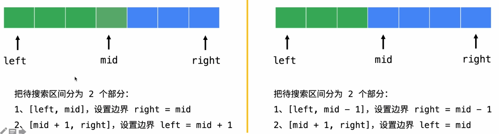
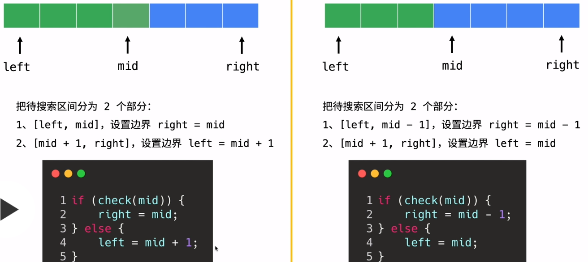

### 二分查找
--------

#### 第一种思路普通
```c++
int search(vector<int>& nums, int target) {
    if (nums.size() == 0) return -1;
    int l = 0, h = int(nums.size() - 1);
        
    while (l <= h) {
        int m = l + ( h - l ) / 2;
        if (nums[m] < target)
            l = m + 1;
        else if (nums[m] > target)
            h = m - 1;
        else
            return m;
    }
    return -1;
}
```

+ 三个判断 `<` `>` `==`
    + `arr[m] < target` : 既然都比目标还小，那就以`m`这个位置为起点不考虑前面的了，但是`m`这个位置算过了，所以`l = m + 1`
    + `arr[m] > target` : 同上比目标大了，就不考虑`m`后面的了`h = m - 1`
    + 最后`==`了就是找到了 直接返回
+ 关于`m`的取值
    + `m = l + ( h - l ) / 2` : 向下取整
    + `m = l + ( h - l + 1) / 2` : 向上取整

    
#### 第二种思路看成两部分
一部分为可能存在的待搜区间，一部分为不可能存在的区间，关键点就是`m`的划分，是分到左还是右
 

基本套路
+ 循环终止条件`while ( l < h );`
+ 写`if else`的时候判断 `arr[m]`满足啥条件时，不是目标元素，再判断`m`左边有没可能有存在的元素，还有右边的 代码表达就只能是下面两种情况
+ `m`分到左边
```c+=
//1
if (arr[m])
    l = m + 1;
else
    h = m;
```
+ `m`分到右边
```c++
if (arr[m])
    l = m;
else
    h = m - 1;
```
+ 边界收缩
`( l + h) / 2`: 取不到 右边（取上值）当`l = h`和`h = m - 1`的时候可能有死循环

 

[传送门](https://leetcode-cn.com/problems/search-insert-position/solution/te-bie-hao-yong-de-er-fen-cha-fa-fa-mo-ban-python-/) 
