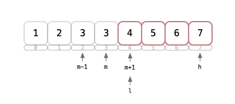
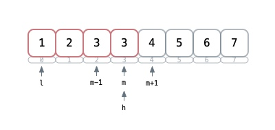

### 二分查找
--------

### 第一种思路普通
```c++
int search(vector<int>& nums, int target) {
    if (nums.size() == 0) return -1;
    int l = 0, h = int(nums.size() - 1);
        
    while (l <= h) {
        int m = l + ( h - l ) / 2;
        if (nums[m] < target)
            l = m + 1;
        else if (nums[m] > target)
            h = m - 1;
        else
            return m;
    }
    return -1;
}
```

+ 三个判断 `<` `>` `==`
    + `arr[m] < target` : 既然都比目标还小，那就以`m`这个位置为起点不考虑前面的了，但是`m`这个位置算过了，所以`l = m + 1`
    + `arr[m] > target` : 同上比目标大了，就不考虑`m`后面的了`h = m - 1`
    + 最后`==`了就是找到了 直接返回
+ 关于`m`的取值
    + `m = l + ( h - l ) / 2` : 向下取整
    + `m = l + ( h - l + 1) / 2` : 向上取整
    
#### 第二种思路看成两部分
一部分为可能存在的待搜区间，一部分为不可能存在的区间，关键点就是`m`的划分，是分到左还是右
 

基本套路
+ 循环终止条件`while ( l < h );`
+ 写`if else`的时候判断 `arr[m]`满足啥条件时，不是目标元素，再判断`m`左边有没可能有存在的元素，还有右边的 代码表达就只能是下面两种情况
+ `m` 位置的元素比目标值 __小__ 说明要搜的数 __一定不在__ `m` 左边←，可能在右边，所以待搜索区间可能在 __[m + 1, h]__ 范围内

 

+ `m` 位置的元素比目标值 __大__ 说明要搜的数 __一定不在__ `m` 右边→，可能在左边，所以待搜索区间可能在 __[l , h]__ 范围内

 

+ `m`分到左边 取了低位`m = l - ( (h - l) >> 1 )` h就要慢慢收缩 
```Csharp
if (check[m] < target)
    l = m + 1;
else
    h = m;
```

+ `m`分到右边 取了高位`m = l - ( (h - l + 1) >> 1 )` l就要慢慢缩
```Csharp
if (check[m] > target)
    h = m - 1;
else
    l = m;
```

+ 边界收缩
`( l + h) / 2`: 取不到 右边（取上值）当`l = h`和`h = m - 1`的时候可能有死循环

 

[传送门](https://leetcode-cn.com/problems/search-insert-position/solution/te-bie-hao-yong-de-er-fen-cha-fa-fa-mo-ban-python-/) 

### labuladong二分查找模板
while属于<=
```
int BinarySearch(int[] arr, int target) {
    int l = 0, r = arr.Length - 1;//[1]
    while (l <= r) {//[2]
        int mid = l + ((r - l) >> 1);[3]
        if (arr[mid] < target) {
            l = ... [4]
        }else if (arr[mid] > target) {
            r = ... [5]
        }else {
            ...[6]
        }
    }
    return ...[7]
}
```
+ `r = arr.Length - 1` 是因为 搜索区间为 __[l , r]__ 闭区间 
+ `l <= r` 是因为在闭区间内如果 __l < r__ ,这时候如果 __l = r__ 了，就会扫不到这个下标的数，因为while循环结束了。为啥结束了？因为 __l<r__ 不满足while循环条件了所以结束。 
+ [3] 这样是往下取mid
+ [4] 中间这个数`arr[mid]`比target还小，说明在target左边，到这里以mid为基准，那么肯定mid左边的数都target小，再加上mid自己已经比较了 所以`l = mid + 1` 不用看左边的范围了。
+ [5] 同[4] 如果比target大了 就没必要看mid右边的了 所以一般`r = mid - 1`
+ 1234都固定写法，区别在于[6] [7] 分找唯一值、最左边值、最右边值：
    - 唯一：[6] 就直接返回mid [7]返回-1
    - 左值：[6] 就要写成`r = mid - 1`因为要往左边缩，所以r就要往左移。最后retun需要判断越界 `l >= arr.Length || arr[l] != t ? -1 : l`
    - 右值：[6] 就要写成`l = mid + 1` 因为要往右边缩，所以l就要往右移。最后retun需要判断越界 `r < 0 || arr[r] != t ? - 1: r`
