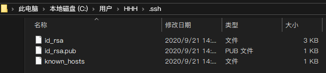
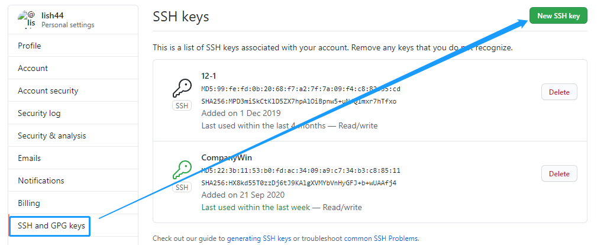

# Win 装 git
--------

### 安装

安装地址: [https://git-scm.com/downloads](https://git-scm.com/downloads) 

具体版本网上搜

### 配置

设置全局用户名
```
git config --global user.name "Your Name"
```
+ Your Name 就是用户名 lish44

设置邮箱
```
git config --global user.email "email@example.com"
```
+ email@example.com 就是github邮箱 lish44@qq.com

### 建立SSH连接

创建密匙
```
ssh-keygen -t rsa -C "邮箱"
```
+ -t 建立密钥对，有RSA和DSA两种 
+ -C 设置注释文字，比如邮箱
+ -f 指定密钥文件存储文件名

### 文件位置

+ Win: `C:\\Users\\HHH\\.ssh`
+ Mac: `./.ssh `
  
三个文件
 

+ id_rsa.pub 里面就是公钥

去GitHub建立ssh
 

添加完成后终端输入
```
$ ssh -T git@github.com 
```
然后输入yes 搞定

参考链接：[https://www.jianshu.com/p/26cda3d42943](https://www.jianshu.com/p/26cda3d42943) 


