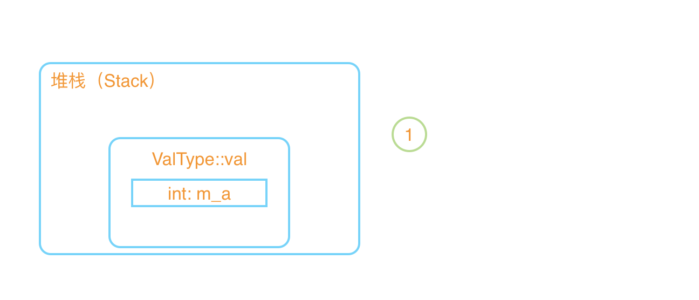
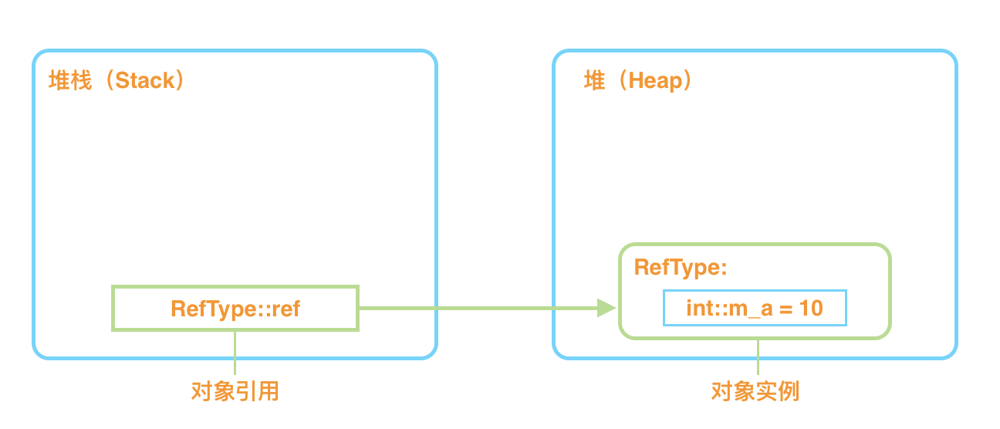

### 值类型和引用类型
--------

#### 值类型
+ 存在 **线程栈**上
```csharp
struct ValType {
    public int m_a;
}
//main
ValType val;//变量声明 会分配到栈 但此时变量val还没被栈上
val.m_a = 10;//对变量进行操作才会 入栈
val.foo();//必须初始化所有字段才能被正常调用

//ValType val = new ValType();
```
+ `new` :
    + 会调用编译器隐式创建的 **无参构造函数** 
        + 值类型赋值为 `0`
        + 引用类型赋值为 `null`
    + 不会在heap上分配内存，也不创建对象实例，仅仅为了调用构造函数
 

#### 引用类型
+ 存在 **堆** 上
```csharp
class RefTypr {
   int m_a = 10; 
}
//main
RefType ref = new RefType();
```
+ `new` 简单来说会做以下事：
    + 在堆中开辟空间
    + 在开辟的空间中调用对象
    + 调用构造函数 - - 初始化对象用的

 

+ 总结：
    + 值类型总是分配在它声明的地方：
        + 作为字段时，跟随其所属的变量（实例）存储
        + 作为局部变量时，存储在栈上
    + 引用类型部署在托管堆上
--------
#### String是引用类型

+ 字符串每次赋值拼接操作，都会在 **堆** 里面重新开一空间存对象，然后指向这个对象 效率低 用StringBuilder
```csharp
using System.Diagnostics; //stopwatch
using System.Text; //stringbuilder

//main

// string str = "";                         // 花费 00:00:00.8444089
StringBuilder str = new StringBuilder ();   // 花费 00:00:00.0005939
Stopwatch sw = new Stopwatch ();
sw.Start ();
for (int i = 0; i < 100000; i++) {
    // str += "1";
    str.Append ("1");
}
sw.Stop ();
System.Console.WriteLine (sw.Elapsed);

```
+ 值类型存在栈，引用类型的 **引用** 存在栈（其实就是地址），实例本身存储在堆中。

+ `==`比较 **栈** 里面的值是否相等 - - (值比较 )

+ 对于值类型，如果对象的值相等，则相等运算符 (==) 返回 true，否则返回 false。

+ 对于引用型变量表示的是两个变量在堆中存储的地址是否相同，即栈中的内容是否相同。

+ Equals它比较的是堆里面的值是否相等(引用地址值比较)

+ Object.ReferenceEquals(obj1,obj2)它是比较的是内存地址是否相等  
参考地址 [传送门](https://www.cnblogs.com/Fflyqaq/p/11756111.html<Paste>)
