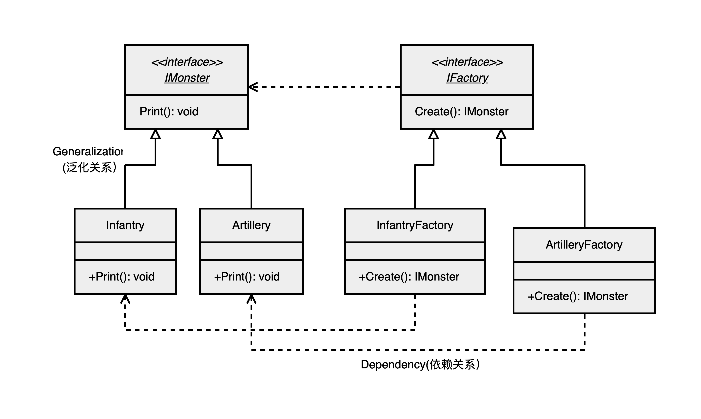

# 工厂模式 - - 工厂方法

### 基本思想

工厂方法是针对每一种产品提供一个工厂类。通过不同的工厂实例来创建不同的产品实例。在同一等级结构中，支持增加任意产品

### UML关系
 

### 实现

+ 定义两个接口 - - 也可以是抽象类
```csharp
interface IFactory {
    IMonster Create ();
}
interface IMonster {
    void print ();
}
```

+ 定义具体产品 - - 这样做是为了多态
```csharp
class Infantry : IMonster {
    public void print () {
        System.Console.WriteLine ("创建步兵");
    }
}
class Artillery : IMonster {
    public void print () {
        System.Console.WriteLine ("创建炮兵");
    }
}
```

+ 分别定义产 **具体产品** 的工厂
```csharp
class InfantryFactory : IFactory {
    public IMonster Create () {
        return new Infantry ();
    }
}
class ArtilleryFactory : IFactory {
    public IMonster Create () {
        return new Artillery ();
    }
}
```

+ <font color = "red">main测试</font>
```csharp
static void Main () {

    IFactory f = new InfantryFactory ();
    f.Create ().print ();
    
    IFactory f1 = new ArtilleryFactory ();
    f1.Create ().print ();
    
}
```

### 优缺点
+ 优点
    + 更符合 **开闭原则** 
        + 允许系统在不修改具体工厂角色的情况下引进新产品
        + 而简单工厂就要修改判断逻辑
    + 符合 **单一原则**
        + 每个具体工厂只负责对应产品
+ 缺点
    + 由于每加一个产品，就需要加一个产品工厂的类，增加了额外的开发量,更多的类需要编译和运行，同时会给系统带来额外的开销
    + 使用时，如果更换产品，任然需要修改实例化的具体工厂类
