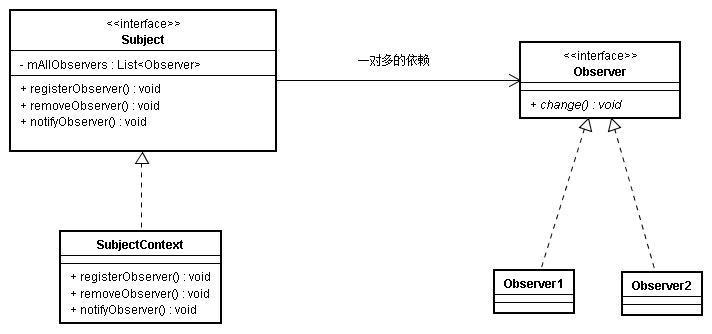

# 观察者模式

### 基本思想

+ 一个目标物件管理所有相依于它的观察者物件，并且在它本身的状态改变时主动发出通知，一对多的关系
+ 大白话：我办了个篮球培训班，娃儿些都在我这报名，我每次教一个技能,娃儿些都能更新他们技能，并且这些娃儿我全部认得到

### UML关系

 

### C# 实现
```csharp
using System;
using System.Collections.Generic;

namespace C_ {

    /// <summary>
    /// 具体状态
    /// </summary>
    enum ENUM_STATE {
        RAP, //唱
        DANCE, //跳
        PLAY_BALL //打篮球
    }

    /// <summary>
    /// 观察者接口 通过这个接口的方法来接收通知
    /// </summary>
    interface Observe {
        void Change ();
    }

    /// <summary>
    /// 订阅者接口 三个方法 注册 注销 通知
    /// </summary>
    interface Subject {

        /// <summary>
        /// 注册
        /// </summary>
        /// <param name="observe">注册观察者</param>
        void Rigster (Observe observe);

        /// <summary>
        /// 注销
        /// </summary>
        /// <param name="observe">注销的观察者</param>
        void Remove (Observe observe);

        /// <summary>
        /// 通知
        /// </summary>
        void Notify ();

    }

    /// <summary>
    /// 具体的通知人如 秘书
    /// </summary>
    class Secretary : Subject {

        IList<Observe> observes = new List<Observe> ();

        /// <summary>
        /// 状态属性：通知人更改的状态
        /// </summary>
        private ENUM_STATE state;
        public ENUM_STATE State {
            get { return state; }
        }

        /// <summary>
        /// 设置状态属性
        /// </summary>
        /// <param name="e">状态</param>
        public void SetState (ENUM_STATE e) {
            this.state = e;
        }

        /// <summary>
        /// 通知：通知所有观察者
        /// </summary>
        public void Notify () {
            foreach (var item in observes) {
                item.Change ();
            }
        }

        /// <summary>
        /// 移除观察者
        /// </summary>
        /// <param name="observe"></param>
        public void Remove (Observe observe) {
            observes.Remove (observe);
        }

        /// <summary>
        /// 注册观察者
        /// </summary>
        /// <param name="observe">观察者</param>
        public void Rigster (Observe observe) {
            observes.Add (observe);
        }
    }

    /// <summary>
    /// 具体观察者 如员工
    /// </summary>
    class Employees : Observe {

        /// <summary>
        /// 发布者 实例秘书
        /// </summary>
        public Secretary subjecter;

        // 员工名字
        public string name { get; set; }

        /// <summary>
        /// 员工构造函数
        /// </summary>
        /// <param name="s">秘书：通知我的秘书</param>
        /// <param name="name">名字</param>
        public Employees (Secretary s, string name) {
            this.subjecter = s;
            this.name = name;
        }

        /// <summary>
        /// 状态更变后的 做出对应的行为
        /// </summary>
        public void Change () {

            System.Console.WriteLine ("{0}：已收到,并且开始{1}", name,this.subjecter.State);
        }
    }
}
```

main 测试
```csharp
Secretary s1 = new Secretary ();
Employees e1 = new Employees (s1, "cxk1");
Employees e2 = new Employees (s1, "cxk2");

s1.Rigster (e1);
s1.Rigster (e2);

s1.SetState (ENUM_STATE.RAP);
s1.Notify ();

//cxk1：已收到,并且开始RAP
//cxk2：已收到,并且开始RAP
```

### 优缺点

##### 优点：
+ Subject和Observer之间是松偶合的，分别可以各自独立改变

+ Subject在发送广播通知的时候，无须指定具体的Observer，Observer可以自己决定是否要订阅Subject的通知

+ 遵守大部分GRASP原则和常用设计原则，高内聚、低偶合

##### 缺点：
+ 如果一个被观察者对象有很多的直接和间接的观察者的话，将所有的观察者都通知到会花费很多时间

+ 如果在观察者和观察目标之间有循环依赖的话，观察目标会触发它们之间进  行循环调用，可能导致系统崩溃

+ 观察者模式没有相应的机制让观察者知道所观察的目标对象是怎么发生变化的，而仅仅只是知道观察目标发生了变化

