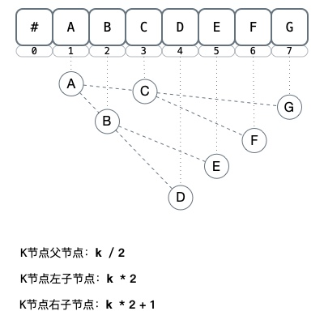
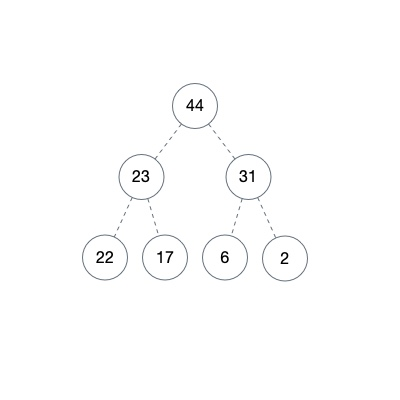
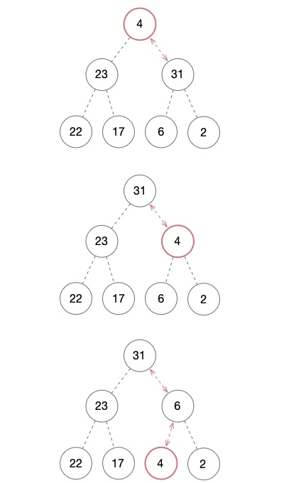
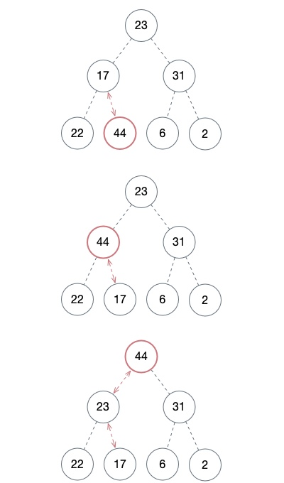

# 堆
--------

### 堆的本质
其实就是用 __数组__ 表示 __完全二叉树__

 

+ 相当于用数的层序遍历就可访问
+ 数组第一位不用是为了方便计算
+ 如果从第一位[0]开始算
    - 父节点：`(i - 1) / 2` 
    - 左子节点：`2i + 1` 
    - 右子节点：`2i + 2` 
+ 因为是数组所以访问的时候需要判断索引越界问题
    

### 堆的属性
其实只有两种结构 __大顶堆__ __小顶堆__ 

+ 大顶堆
    - 父节点的值比每一个子节点的值都要 __大__
    - 左右子节点大小无所谓反正只要比父节点小就行 （这里就要和二叉搜索树BinarySearchTree 分清楚） 

 

+ 小顶堆
    - 父节点的值比每一个子节点的值都要 __小__
    - 左右节点同上

### 堆的操作

其实就是为了维持 “堆” 的特点 进行的操作

#### 下沉 Heapify
父节点往下走

 

#### 上浮

子节点往上走

 

其实本质就是在数组中交换位置 （用数来表示方便理解）

因为是递归操作 所以时间复杂度是 O(log n)

#### 入堆出堆操作

`push(item)` ：添加到堆尾（其实就是在数组最后一位添加元素），然后进行 上浮操作 调整结构

`pop()` ：弹出堆顶元素，然后把堆的最后一个元素拿过来，然后进行 下沉操作 

`peek()` ：看堆顶元素

[具体实现](../algorithm/HeapSort.md) 
