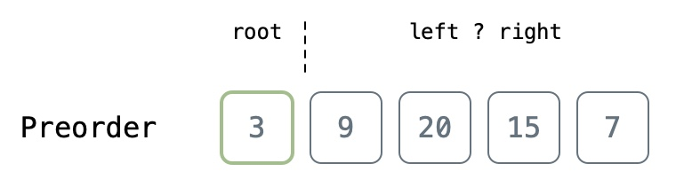
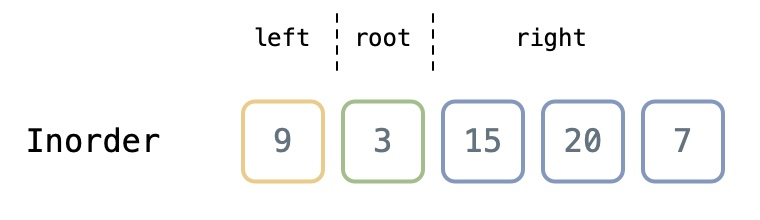
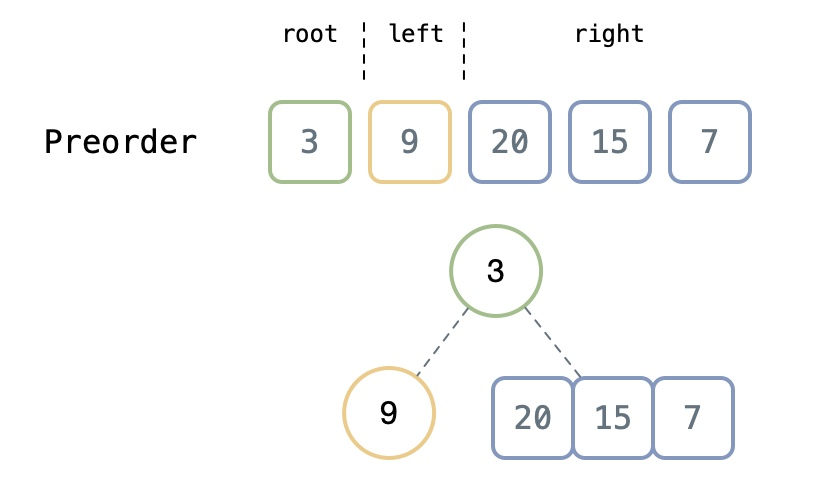
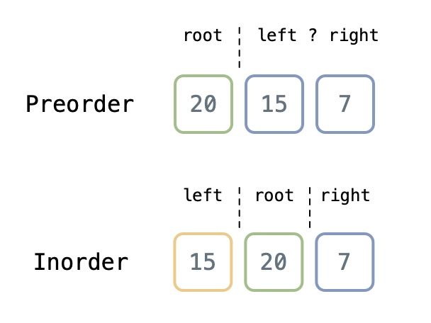
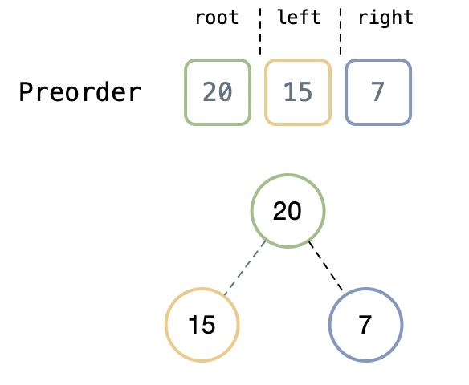
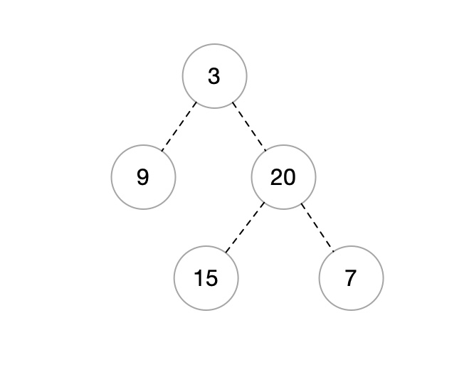
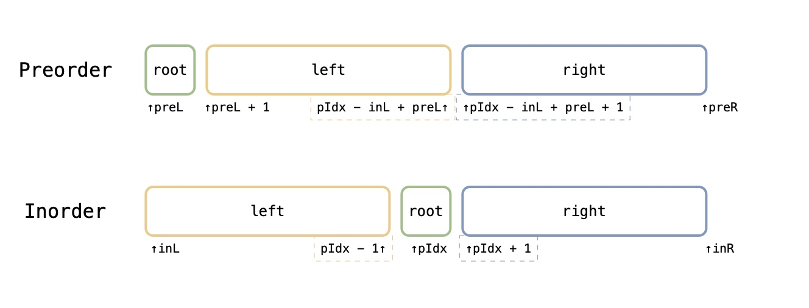

# 二叉树
--------

## 定义

## 节点实现
```csharp
public class TreeNode {
    public int val;
    public TreeNode left;
    public TreeNode right;
    public TreeNode(int val=0, TreeNode left=null, TreeNode right=null) {
        this.val = val;
        this.left = left;
        this.right = right;
    }
}
```

## 一些遍历

### 前序遍历

根 -> 左 -> 右

Recursive
```csharp
IList<int> l = new List<int> ();
public IList<int> Preorder (TreeNode root) {
    if (root != null) {
        l.Add (root.val);
        Preorder (root.left);
        Preorder (root.right);
    }
    return l;
}
```

Iteration
```csharp
public void PreorderRecursive (TreeNode root) {
    IList<int> l = new List<int> ();
    Stack<TreeNode> s = new Stack<TreeNode> ();
    s.Push (root);// 头先入栈
    while (s.Count > 0) {// 只要栈里还有东西就继续
        TreeNode curNode = s.Pop ();
        l.Add (curNode.val);
        if (curNode.right != null) s.Push (curNode.right);
        if (curNode.left != null) s.Push (curNode.left);
    }
}
```

+ 迭代用栈模拟
+ 因为先进后出特性 加上前序遍历是先 __根__ 后 __左__ 再 __右__ 所以在while循环中 就要 __右__ 先进 __左__ 后进 最后出来的结果就是 先左后右符合前序遍历特点 根的话一开始进去就出来了

### 中序遍历
左 -> 根 -> 右

Recursive
```csharp
public void InorderRecursive (TreeNode root) {
    IList<int> l = new List<int> ();
    Stack<TreeNode> s = new Stack<TreeNode> ();
    TreeNode curNode = root;// 当前节点为已搜索节点 就是存在的节点
    while (s.Count > 0 || curNode != null) {// 只要curNode和s不是空 就继续
        while (curNode != null) {// 一直往左边迭代下去 直到cur为空 只要为空了就说明走到了数的最左下角节点
            s.Push (curNode);// 每次压进去为了回溯
            curNode = curNode.left;
        }
        TreeNode tmpNode = s.Pop ();// while出来了就说明 s里面的栈顶的节点没得左子树了 s里面的栈顶的节点就是要找的点
        l.Add (tmpNode.val);
        if (tmpNode.right != null) curNode = tmpNode.right;// 这里就是看 弹出来这个点 右边还有没子树 有的话就给cur 然后以cur为基准进行新的一轮while（里面的while）直到cur为空 s也为空
    }
}
```

+ 总的来说就是用一个栈来模拟，创建一个cur指针，一直往左边的节点迭代下去，每次迭代都入栈，当走到最后一个（也就是最左边那个节点）就停止（整个迭代在while里面进行），然后操作栈顶的元素（第一次的话就是最左下节点），取出来看它还有没右子节点，有的话cur指过去，然后while的时候又入栈 也就是说在子while中每都次以cur为路线找左节点 如此循环，再利用了栈的特性 直到右节点为空并且栈也为空时撒过

### 二叉树构建
#### 构建方式
[×] 只有前序 5种状态
[×] 前后序 2种状态
[√] 前中序
[√] 中后序


#### 通过前序中序构建

前序遍历在数组中的第一位就是根节点root 但是无法确定左右子树



--------

通过中序遍历的结果关系可已确定左右子树

 
--------

进而在前序遍历中确定 左右子树

 
--------

通过递归以相同的方法继续构建左右子树 此时左子树只有一个不用管了 右边有三个大于一个 递归继续

 
--------

确定子树位置

 
--------

完成构建

 
--------

#### 计算边界和递归范围

首先确定pre数组左右边界 __[rpeL,preR]__ （闭区间）in数组同理

 

+ `preL + 1` 就是在前序遍历中的 <font color=#ffbc32>left左子树</font> __起点__
+ `pIdx - inL + preL` 就是在前序遍历中的 <font color=#ffbc32>left左子树</font> __终点__ 
+ `pIdx` 就是中序遍历中<font color=#0aa858>root</font> 的下标
+ 其他位置如图同理计算

#### 实现步骤

1. 首先记录两个数组的长度
```Csharp
int preLen = preorder.Length;
int inLen = inorder.Length;
```

2. 特判一下
```Csharp
if (preLen != inLen) return new TreeNode();
```

3. 用字典存一下中序遍历的下标与与值
```Csharp
Dictionary<int, int> dic = new Dictionary<int, int> ();
for (int i = 0; i < inLen; ++i) {
    dic.Add (inorder[i], i);
}
```

4. 编写递归函数参数条件
```Csharp
return RecBuildTree (preorder, 0, preLen - 1, dic, 0, inLen - 1);
```

5. 递归实现
```Csharp
private TreeNode RecBuildTree (int[] preorder, int preL, int preR, Dictionary<int, int> inorderdic, int inL, int inR) {
    if (preL > preR || inL > inR) return null;

    int rootVal = preorder[preL]; // 找到根节点值
    TreeNode root = new TreeNode (rootVal); //创建
    // 找到前序遍历的root节点 在中序遍历中的位置 通过dic获取 
    int pIdx = inorderdic[rootVal];
    //然后构建 模糊的话更上面的图来结合其看
    root.left = RecBuildTree (preorder, preL + 1, pIdx - inL + preL, inorderdic, inL, pIdx - 1);

    root.right = RecBuildTree (preorder, pIdx - inL + preL + 1, preR, inorderdic, pIdx + 1, inR);

    return root;
}
```

#### 精选代码
```Csharp
public TreeNode BuildTree (int[] preorder, int[] inorder) {
    return helper (0, 0, inorder.Length - 1, preorder, inorder);
}

private TreeNode helper (int preStart, int inStart, int inEnd, int[] preorder, int[] inorder) {
    // 递归终止条件 
    if (preStart > preorder.Length - 1 || inStart > inEnd) return null;

    // 构建root
    TreeNode root = new TreeNode (preorder[preStart]);

    // Index of current root in inorder
    int inIdex = 0;
    // 在 inorder 里面找 root 
    for (int i = inStart; i <= inEnd; ++i)
        if (inorder[i] == root.val)
            inIdex = i;
    // 递归构建 rec
    root.left = helper (preStart + 1, inStart, inIdex - 1, preorder, inorder);

    root.right = helper (preStart + inIdex - inStart + 1, inIdex + 1, inEnd, preorder, inorder);

    return root;
}
```

<++>

