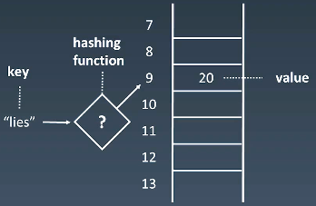

### Hash Table
--------


### 定义
**哈希表也叫散列表 根据 <font color=#4285f4>关键码/值(key / value) </font> 而进行访问的数据结构**

### Hash Collisions
 

--------


c#中 的Hashtable添加元素 以object为单位
```
// Hashtable的实例方法
public virtual void Add(object key, object value);
```
+ 这里 <font color=#4285f4>key</font> 的计算方法调用了 <font color=#0aa858>GetHashCode </font> 方法属于System.Object命名空间下

### Hashtable类中哈希函数计算的方法

```
H(key) = [GetHash(key) + 1 + (((GetHash(key) >> 5) + 1) % (hashsize - 1))] % hashsize
```

+ GetHash(key) 默认用的 key 的 <font color=#0aa858>GetHashCode</font> 方法
+ hashsize 是 哈希表的长度

### Hash冲突
当哈希函数计算出来的值 **相等** 时发生

解决办法
+ 线性探测（Linear Probing） 
+ 二次探测

在Hashtable类中使用了 <font color=#f4433c>二度哈希</font> 
+ 原理： 有一个包含**一组哈希函数 H1···Hn 的集合**,所有哈希函数都和H1类似，当H1计算出冲突就去找H2 直到Hn

在Hashtable类中有个私有成员变量 loadFactor (0.1~1.0) 描述了 占用比 [p116 《Unity3D 脚本编程》]

因为<font color=#4285f4>Key / Value</font> 没有指定特定类型所有均是Object不安全 C#有泛型概念后引入

[return](./index.md)
