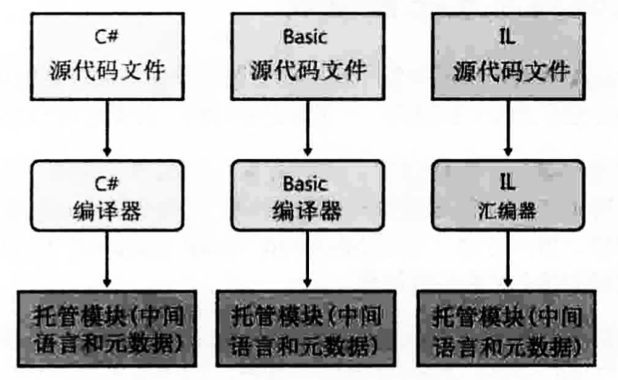
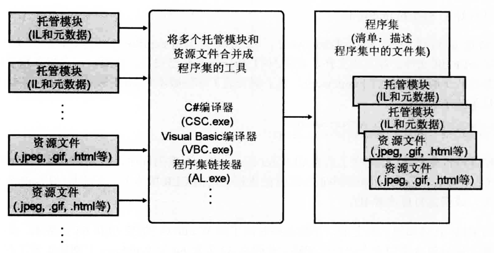
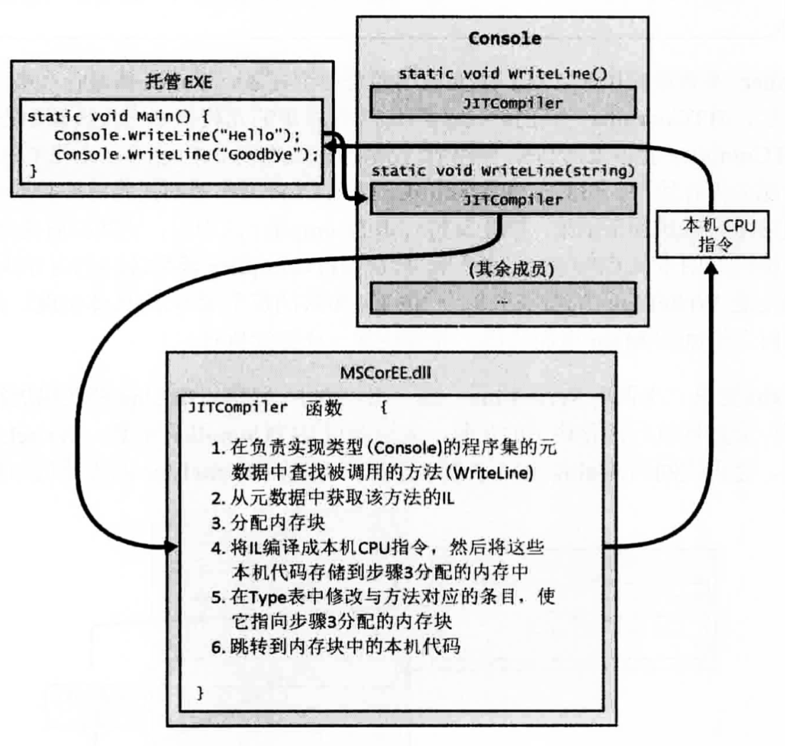

# .NET 笔记 📒
--------


### 啥子是 CLR

定义
+ CLR 公共语言运行时 ( common Language Runtime )
+ 是一个可由多种编程语言使用的 **"运行时"** 
+ 核心功能
    - <font color=#f4433c>内存管理</font>
    - <font color=#f4433c>程序集加载</font>
    - <font color=#f4433c>安全性</font>
    - <font color=#f4433c>异常处理</font>
    - <font color=#f4433c>线程同步</font>

编译器
+ 每种语言都有自己的编译器
+ 作用可视为语法检查器 和 正确代码分析器
 
+ 面向CRL的语言 -> 编译器 最终都会变成 <font color=#4285f4>托管模块</font>

托管模块
+ 
     


### 源代码编译成托管模块

源代码 -> c#编译器 --> 托管模块(managed module) 

托管模块是标准的 **PE32**/**PE32+** 文件 需要CRL才能执行

托管模块包括四个部分

+ PE32/PE32+
+ CRL 头
+ 元数据 - - 主要两种表 1.描述源代码 定义 的类型和成员 2.描述源代码 引用 的类型和成员
+ IL中间语言代码 - - 编译器编译时生成的代码 运行时CRL 把这部分代码 --> CPU指令

### 程序集

是一个或多个 **托管模块** / **资源文件(.mp3..)** 的逻辑分组

 

**编译器默认将生成的 托管模块 转化成 程序集**


### 加载公共语言运行时

生成的每个程序集 可是 可执行文件 也可 DLL文件(里面含有一组由可执行程序使用的类型)

最终是由CRL管理这些程序集中的代码的执行


### 执行程序集的代码

为了执行方法 必须把IL --> CPU指令 - - 通过CRL 的 **JIT ( just-in-time 即时编译器 )** 实现

Main 方法生成之前 CRL会检测 **Main的代码引用** 的所有类型 --> 内部数据结构data_structure 管理对 **引用类型** 的访问

每个类型的每个方法都有一个 **记录项（ entry ）** 这些所有的entry中都含有一个地址，通过此地址可找到方法的实现。 

初始化时 CRL将每个entry设置成(指向)包含在CRL内部的一个未编档函数 （JITCOmpiler) ???

Main 首次调用方法时 会先调用 JITCompiler函数

JITCompiler函数 负责将方法的IL代码编译成CPU指令 - - 【p12】
 
    
+ JITCompiler如何找对应方法？
+ 被调用时它知道方法的地址 以及该方法的类型（上面记录了 entry）
+ 然后会去 该类型 的程序集的元数据中找 该方法的IL
+ 然后验证 接着翻译成本机CPU指令 
+ 然后本机CPU指令保存到动态分配的内存块中
+ 然后JITCompiler回到 CRL为类型创建的内部数据结构（data_structure）并找到被调用方法那条记录entry 使其指向内存块
+ 最后JITCompiler跳到内存中 开始执行代码 这些代码就是函数体逻辑 。。。这行代码执行完后 回到main开始执行下句
+ 第二次执行时 如果是同一类型 第一次已校验和编译 所以直接执行内存块中代码 直接跳过JITCompiler 否者 while 以上步骤

### JIT生成CPU指令的验证

IL 基于栈 IL的所有指令都是将操作数压栈（push）出栈（pop）

IL优点

+ 对底层CPU进行了抽象 只需关心IL本身 转换交给它
+ 健壮性 和 安全性
    - 健壮性(robustness) : 描述系统对于参数变化的不敏感性
    - 安全性 : 参数是否传对、每个方法的返回值都得到正确返回。。

IL --> CPU指令时 会执行一个名为 **验证（verification）** 的过程 ，过程会检查IL高级代码 检查是否安全 如 参数是否传对等。托管模块中会包含验证过程要用到的所有方法及类型信息


## .ENT Framework？？

.ENT Framework包含

+ Framework库类（FCL） 是一组DLL程序集的统称


## 类型转化

### is 和 as

is用于检查对象是否兼容指定类型
```
object o = new Object();
aoolean b1 = (o is Object); // b1 true
Boolean b2 = (o is Employee); // b2 false
```

is常用操作
```
if (o is Employee) {
    Employee e = (Employee) o;
}
```
上代码 有两次对象类型检查 is先核实是否兼容 在转型时CRL再次检查 有一点性能影响 所以用as


