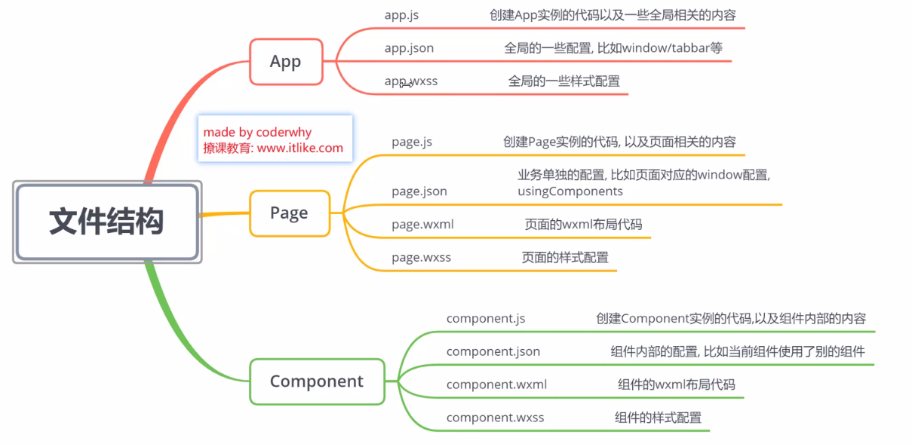

# 微信小程序


### 结构

App -> page -> widget

文件结构
 


### 项目创建
#### 一个app由三个app文件组成两个json
+ app.js

+ app.json - - 全局配置文件 整个小程序入口 每个page也有json当前页面单独配置
    - pages page页面注册入口
    - window 顶部状态栏
    - tabBar 底部dock
+ app.wxss
+ project.config.json - - 项目的配置文件
+ sitemap.json - - 当前小程序项目是否能被外界搜索到 爬虫

#### 一个page 由四个文件组成
+ .js
+ .json
+ .wxml
+ .wxss

### 数据绑定
wxml 里面的content可以打成变量 对应变量在js文件里的data域中
+ __{{}}__ -> Mustache 插值表达式 在标签栏里用

```
// wxml
<view>{{name}}</view>

// js
Page({

  /**
   * 页面的初始数据
   */
  data: {
    name :"haha"
  },
})

```

### 列表绑定


#### 打开场景
```
onShow: function (options) {
    console.log(options.scene)
}
```
#### 获取用户信息
```
wx.getUserInfo({
  success:function(res){
    console.log(res)
  }
})
```

### img组件

<image src"../img/1.png"> 
+ 相对路径
    - __../__ 当前路径退到上一层
+ 绝对路径
    - __D://img/1.png__ 
+ 根目录
    - __/__ 


### Mustache语法
#### 拼接
```
<view>{{fristname}}{{lastname}}</view>
<view>{{data}} + '' + {{lastname}}</view>
```

#### 三目运算符
```
<view>{{age >= 18 ? '成年' : '未成年'}}</view>
```

### 绑定属性
.wxml
```
<view class="{{active ? 'red':'yellow'}}">active==true 红色 ==false 白色</view>
```
.js
```
Page({
  data: {
    active: false
  },
  handleChangeColor() {
    this.setData({
      active : !this.data.active
    })
  }
})
```

.wxss
```
.red{
  color: red;
}
.yellow{
  color: yellow;
}
```
### 循环
wx:for={{"数组或对象"}}

wx:for-item="循环项名称"

wx:for-index="循环项索引"

### swiper
有默认样式
width 100%
height 150px

img默认样式
width 320
hight 240

计算swiper宽高
swiper高 = swiper宽 * 原图宽 / 原图高
ex：100vm（100%） * 320 / 240 - - vm是手机宽？


      
      
