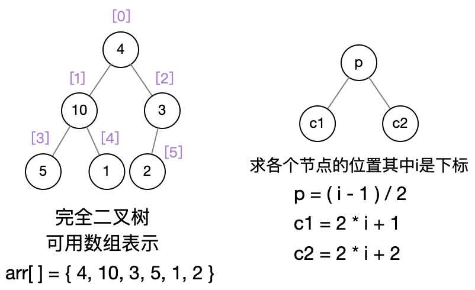
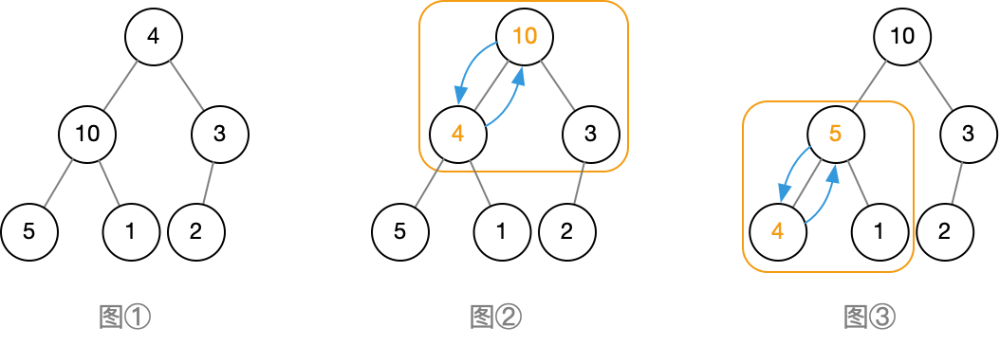
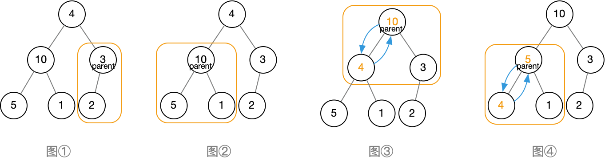

# 堆排序
--------

### 堆的定义
+ 必须是$\color{#4285f4}完全二叉树$
+ 所有父节点$\color{#4285f4}大于$子节点（大顶堆）
所有父节点$\color{#4285f4}小于$子节点（小顶堆）


### 基本思路
+ 以三个节点为单位进行堆调整（大顶堆）-> heapify
+ 然后分别对左右子节点继续进行堆调整（递归）
+ 自底向上进行heapify
+ 最后首尾交换进行排序


### 代码实现
+ Heapify递归实现
```c++
#include <iostream>
using namespace std;

void swap (int tree[], int i, int j){
    int temp  = tree[i];
    tree[i] = tree[j];
    tree[j] = temp;
}

/**
 * @param tree 待构建堆
 * @param n 一共有几个节点
 * @param i 想要对那个节点进行操作
*/
void Heapify (int tree[], int n, int i) {
    if (i >= n)
        return;
    int c1 = 2 * i + 1;//左子节点下标
    int c2 = 2 * i + 2;//右子节点小标
    int max = i;//默认父节点最大 也是下标
    //左边节点值 > 父节点值 && 左没超过堆的大小n 就把左下标认为是最大下标
    if (c1 < n && tree[c1] > tree[max])
        max = c1;
    if (c2 < n && tree[c2] > tree[max])
        max = c2;
    //上面两个if没成立就不用交换 本身父节点就最大
    if (max != i){
        swap(tree,max,i);
        Heapify(tree, n, max);//这里max经过上面的判断 要么是c1 要么c2 继续递归下去 直到i > n 结束

    }
}
```

+ 构建堆自底向上
```c++
void buildHeap(int tree[], int n){
    int lastNode = n - 1;
    int parent = (lastNode - 1) / 2;
    for ( int i = parent; i >= 0; i-- ){
        Heapify(tree, n, i);
    }
}
```

+ 排序
```c++
void HeapSort(int tree[], int n){
    buildHeap(tree, n);
    for (int i = n - 1; i >= 0; i--){
        swap(tree,i,0);
        Heapify(tree,i,0);
    }
}
```


+ 构建堆
    + 算左右节点位置  i * 2 + 1
    + max = i;
    + 比大小确定最大下标 && 下标不能超过 n最大节点数量
    + 当max != i时 进行交换 并递归下去

+ 自底向上算每个heapify，其中每个heapify又自身递归向下做调整
    + 算最后一个节点 lastindex = n  - 1;
    + 从最后一个节点的父节点开始heapify 即：p = (lastindex - 1) / 2;
    + for--迭代 直到根节点 == 0
+ 排序
    + 先用第二部构建，现在堆已经构建完整
    + p永远比子节点大，所以用swap(lastindex,0)
