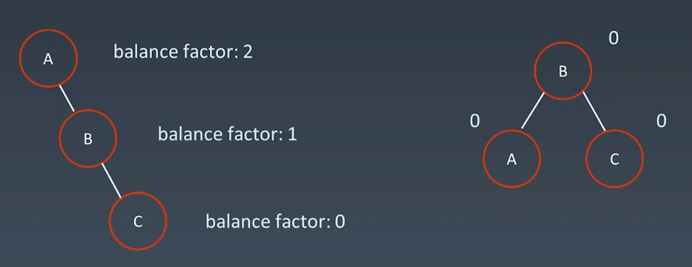
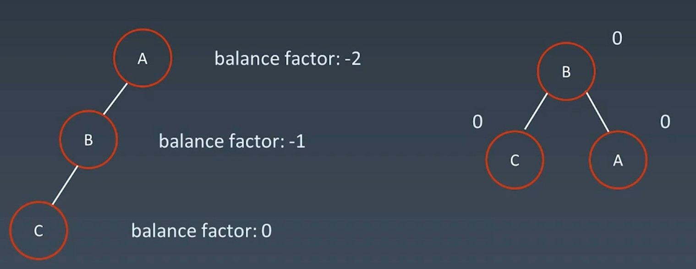
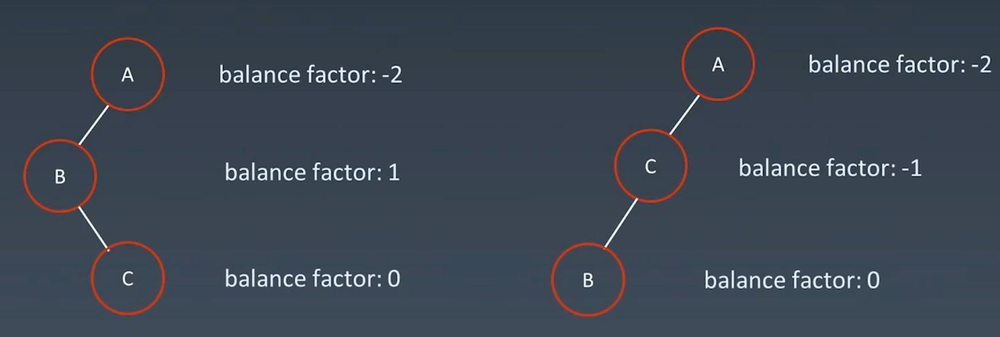
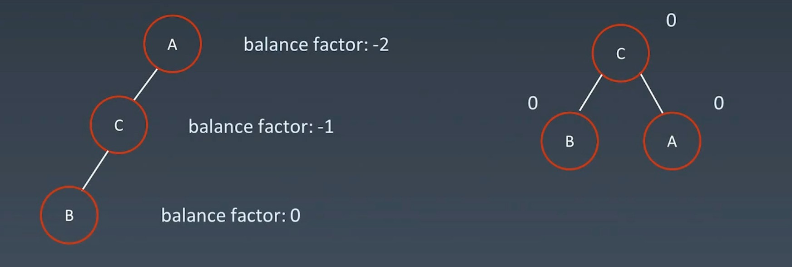
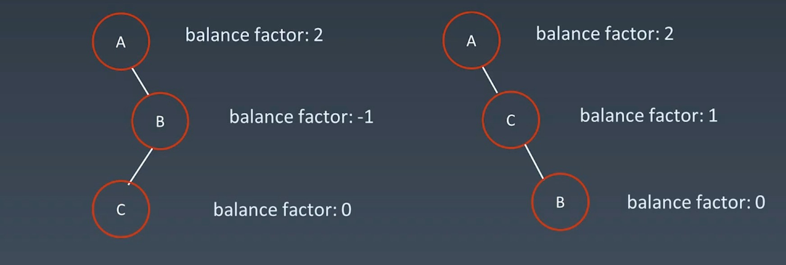
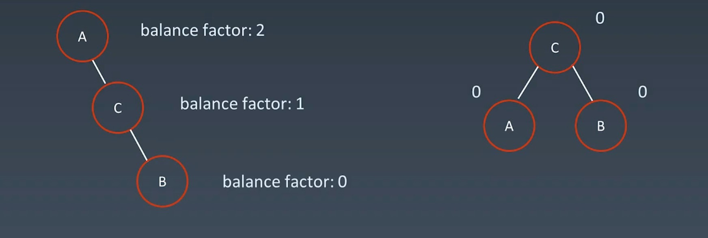
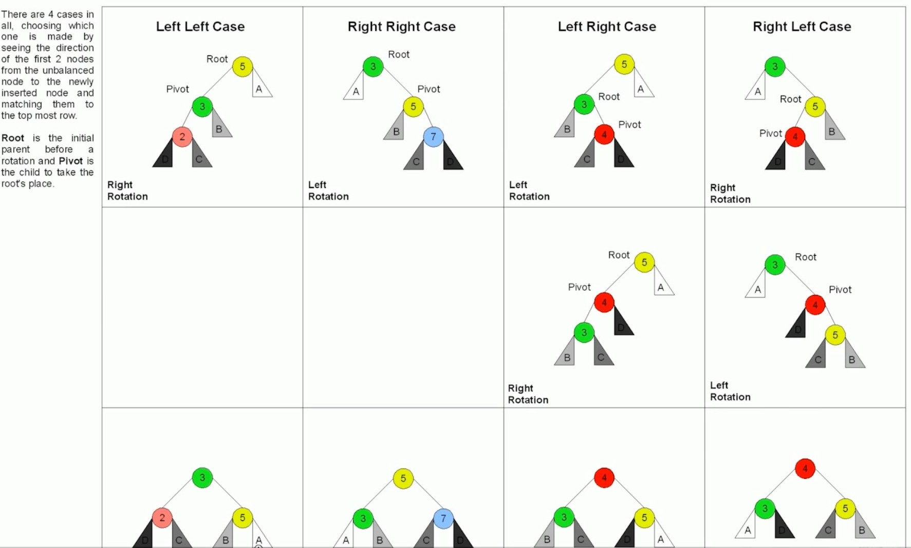

# 树
--------

## AVL树

### 树的高度
+ 从根节点出发 走到最底层节点的个数就是高度 root(2) -> l(1) -> r(3) 这个树的高度就是1

### 平衡因子 Balance Factor
+ 每个节点都一个 Balance Factor ，就是当前节点的 __左树的高度__ - __右树的高度__ (有时相反) 得到一个值就是高度的差
+ AVL 中的 Balance Factor 保证在{-1,0,1} 范围内
+ 当插入或删减时 打破这个平衡因子 就要进行旋转
### 四种旋转操作

本质只有前两种，后面的是前两个的结合，但有些结构要旋两次 所有出来四种

#### 左旋
右右子树 -> 左旋
 

#### 右旋
左左子树 -> 右旋 
 

#### 左右旋
先左旋一次 因为 C > B 且 C < A 的 所以B拉下来C顶上去 就是把A节点的左子树引用成C
 
变成左左子树和上面一样再进行一次右旋就ok
 

#### 右左旋
 
 

#### 带有子树的旋转
 

