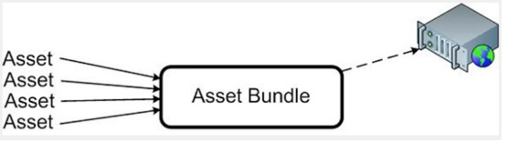
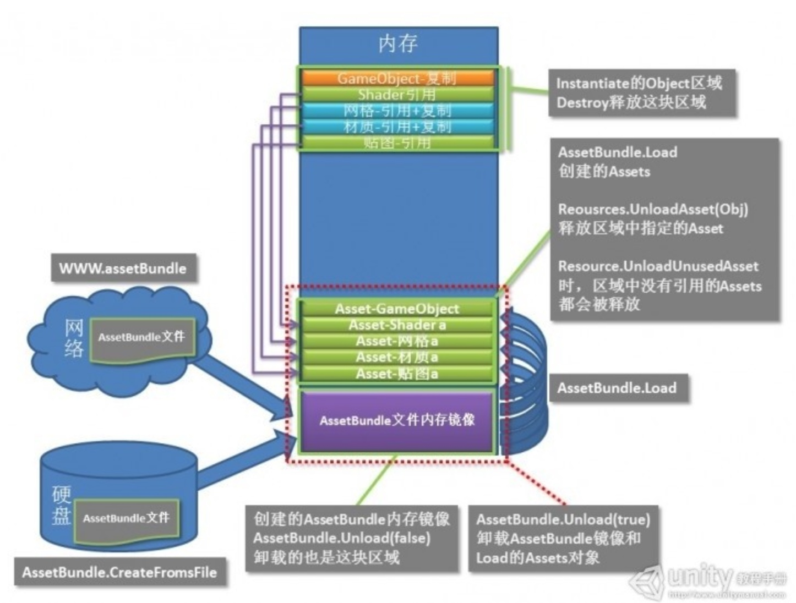

# AssetBundle

### 本质
+ 其实就是unity自己定义的一种资源文件（二进制类型），一种压缩包，用 `LZMA` 或 `LZ4` 压缩算法来压缩 
+ 包含了 __模型__  __贴图__  __prefab__  __声音__  __场景__ 
+ 因为压缩了所以体积小 传输的时候速度快 
   

### 创建
1. 游戏对象弄成预设体 -> 右下角有AssetBundle设置保存路径和后缀名（后缀随意） -> 用下面的方法生成就对了

2. 用 `BuildPipeline.BuikdAssetBundlles()` 这个方法

3. 创建后在指定目里有 `AssetBundles` 文件 和名字一样的 `.manifest` 文件，这个文件其实就是描述性文件，说明了ab有些说明东西版本之类的

### 加载流程
#### 脚本流程
1. 用unity提供的 `AssetBundle.Load...()` 的加载方式加载，返回的是一个AssetBundled对象
2. 用 `AssetBundle.LoadAsset()` 把资源加载出来，返回是一个Asset对象
3. 最后用 `Instantiate` 实例化到场景中

#### 内存模型
##### 构建过程
首先 __ab包__ 要么在服务器上，要么在硬盘上。然后通过加载（Load）后就把 __ab包__ 弄到了内存里头，这个时候还没资源（Asset）的概念，它只是一个 __AssetBundle内存镜像数据块__ 。然后用 `AssetBundle.Load(同Resources.Load)` 加载后才会从ab内存镜像读取并且创建一个 __Asset对象__ (程序中表现的也就是GameObject对象)。这个时候内存中有两个部分：1.ab包的内存镜像 2.Asset对象（材质、贴图、网格。。）。最终加载到场景中是用 __Instantiate()__ 函数，它其实就是从Asset对象中Clone+引用（clone的是transform，引用的是mesh、texture、material等）。此时内存中就有了这 “1” “2” “3” 块部分

##### 删
+ __Destroy()__ 一个游戏对象，其实只是释放第“3”部分clone的那些对象
+ __Reousrces.UnloadAsset(Obj)__ 释放的就是第“2”部分中指定的Asset
+ __Reousrces.UnloadUnuseAsset()__ 释放的就是第“2”部分中没被引用的Asset
+ __AssetBundle.Unload(false)__ 释放的就是第“1”部分 ab内存镜像
+ __AssetBundle.Unload(true)__ 释放的就是第“1”和“2”部分所有资源
+ 最后系统在加载新场景时，所有的内存对象都会被自动销毁，包括你用AssetBundle.Load加载的对象和Instaniate克隆的。但是不包括AssetBundle文件自身的内存镜像，那个必须要用Unload来释放，用.net的术语，这种数据缓存是非托管的。

 

### 关于优化
1. 不管从服务器加载还是从内存加载，用ab.load加载需要的Asset资源后，立马用 __AssetBundle.Unload(false)__ 释放ab镜像资源
 
2. 如果有Instantiate的对象，用Destroy进行销毁，在合适的地方调用Resources.UnloadUnusedAssets,释放已经没有引用的Asset.

3. 如果需要立即释放内存加上GC.Collect()，否则内存未必会立即被释放，有时候可能导致内存占用过多而引发异常。

### 托管堆优化
1. 一般来说无非就是 __new__ 和 __Instantiate__ (其实ins内部也是调用了new）。收到alloca请求后 根据对象大小在托管堆中申请分配内存 不够的话就要向系统申请

2. 不用了就要设置为 __null__ 或者 __Destroy__ （但是des消耗性能），引用对象没有被引用之后 Mono的GC会检测到 然后在合适的时机回收，

3. 总之就是尽快的把不用的对象设为null让其不被引用 等待GC回收

4. 对象池

