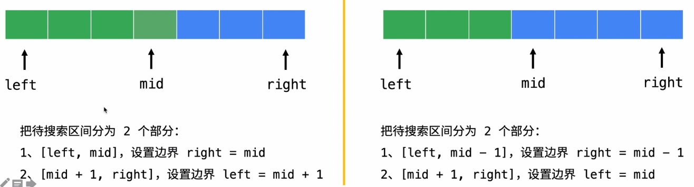
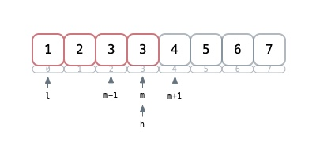
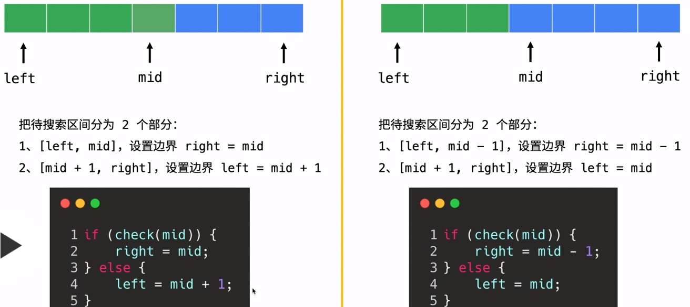

### 二分查找
--------

### 第一种思路普通
```c++
int search(vector<int>& nums, int target) {
    if (nums.size() == 0) return -1;
    int l = 0, h = int(nums.size() - 1);
        
    while (l <= h) {
        int m = l + ( h - l ) / 2;
        if (nums[m] < target)
            l = m + 1;
        else if (nums[m] > target)
            h = m - 1;
        else
            return m;
    }
    return -1;
}
```

+ 三个判断 `<` `>` `==`
    + `arr[m] < target` : 既然都比目标还小，那就以`m`这个位置为起点不考虑前面的了，但是`m`这个位置算过了，所以`l = m + 1`
    + `arr[m] > target` : 同上比目标大了，就不考虑`m`后面的了`h = m - 1`
    + 最后`==`了就是找到了 直接返回
+ 关于`m`的取值
    + `m = l + ( h - l ) / 2` : 向下取整
    + `m = l + ( h - l + 1) / 2` : 向上取整
    
#### 第二种思路看成两部分
一部分为可能存在的待搜区间，一部分为不可能存在的区间，关键点就是`m`的划分，是分到左还是右
 

基本套路
+ 循环终止条件`while ( l < h );`
+ 写`if else`的时候判断 `arr[m]`满足啥条件时，不是目标元素，再判断`m`左边有没可能有存在的元素，还有右边的 代码表达就只能是下面两种情况
+ `m` 位置的元素比目标值 __小__ 说明要搜的数 __一定不在__ `m` 左边←，可能在右边，所以待搜索区间可能在 __[m + 1, h]__ 范围内

 

+ `m` 位置的元素比目标值 __大__ 说明要搜的数 __一定不在__ `m` 右边→，可能在左边，所以待搜索区间可能在 __[l , m]__ 范围内

 

+ `m`分到左边 取了低位`m = l - ( (h - l) >> 1 )` h就要慢慢收缩 
```Csharp
if (check[m] < target)
    l = m + 1;
else
    h = m;
```

+ `m`分到右边 取了高位`m = l - ( (h - l + 1) >> 1 )` l就要慢慢缩
```Csharp
if (check[m] > target)
    h = m - 1;
else
    l = m;
```

+ 边界收缩
`( l + h) / 2`: 取不到 右边（取上值）当`l = h`和`h = m - 1`的时候可能有死循环

 

[传送门](https://leetcode-cn.com/problems/search-insert-position/solution/te-bie-hao-yong-de-er-fen-cha-fa-fa-mo-ban-python-/) 

### labuladong二分查找模板
while属于<=
```
int BinarySearch(int[] arr, int target) {
    int l = 0, r = arr.Length - 1;//[1]
    while (l <= r) {//[2]
        int mid = l + ((r - l) >> 1);[3]
        if (arr[mid] < target) {
            l = ... [4]
        }else if (arr[mid] > target) {
            r = ... [5]
        }else {
            ...[6]
        }
    }
    return ...[7]
}
```
+ `r = arr.Length - 1` 是因为 搜索区间为 __[l , r]__ 闭区间 
+ `l <= r` 是因为在闭区间内如果 __l < r__ ,这时候如果 __l = r__ 了，就会扫不到这个下标的数，因为while循环结束了。为啥结束了？因为 __l<r__ 不满足while循环条件了所以结束。 
+ [3] 这样是往下取mid
+ [4] 中间这个数`arr[mid]`比target还小，说明在target左边，到这里以mid为基准，那么肯定mid左边的数都target小，再加上mid自己已经比较了 所以`l = mid + 1` 不用看左边的范围了。
+ [5] 同[4] 如果比target大了 就没必要看mid右边的了 所以一般`r = mid - 1`
+ 1234都固定写法，区别在于[6] [7] 分找唯一值、最左边值、最右边值：
    - 唯一：[6] 就直接返回mid [7]返回-1
    - 左值：[6] 就要写成`r = mid - 1`因为要往左边缩，所以r就要往左移。最后retun需要判断越界 `l >= arr.Length || arr[l] != t ? -1 : l`
    - 右值：[6] 就要写成`l = mid + 1` 因为要往右边缩，所以l就要往右移。最后retun需要判断越界 `r < 0 || arr[r] != t ? - 1: r`

### b战 五点七边 模版

确定红蓝边界，初始值 `l = -1` `h = len(arr)` ，l就是红的右边界，h是蓝的
左边界，起初都为区域都为空，随for条件判断l和h会相切，条件是 `l + 1 != h` 会保证l和h不相交，边界收缩的条件是

```
if isblue() {
	l = m
}else {
	h = m
}
```
最后根据落点处理该返回l还是h

特别注意如果没有在搜到l或者h可能会越界，需要特判

目标数t大于m（arr[m] < t)，区间在右边，收l也就是`l = m`，反之亦然 


### 二叉树
--------

### 基本定义
**度** 

一个节点有几个娃儿就有几个度，二叉树的度 **0 <= 度 <= 2** <++>


**层** 


**特点** 

+ 在二叉树的第i层上最多有2^i-1 个节点 。（i>=1）如第二层最多2个，三层最多4个节点

**深度和高度** 

深度从上到下 计算时从0开始，如果只有一个节点其深度为1，否则结果+1

高度从下到上 计算时从0开始，

计算树高度其实就计算树的深度
+ 递归往下走直到最大叶子节点
```c++
int BinaryTreeHeight(Node *node)
{
    int treeHeight = 0;
    if (node != NULL)
    {
        int leftHeight = BinaryTreeHeight(node->lChild);
        int rightHeight = BinaryTreeHeight(node->rChild);
        treeHeight = leftHeight >= rightHeight? leftHeight + 1:rightHeight + 1;
    }
 
    return treeHeight;
}
```


```c++
int BinaryTree::Depth(Node* root){
    if (!root) return 0;//没有东西就反0
    
    int left = Depth(root->left);
    int right = Depth(root->right);
    
    return left > right ? left + 1 : right + 1;
}
```

**个数** 
```c++
int BinaryTree::Size(Node* root) const {
    if (!root) return 0;
    return Size(root->left) + Size(root->right) + 1;
}
```

<++>


### 二叉树前序遍历
我想先打印头节点对吧？那我打印完了头节点，我现在想打印左边节点了，<u>我只是告诉计算机我想打印左边结点，之后打印右边结点</u>。

递归
```c++
vector<int> ans;
vector<int> preorderTraversal(TreeNode* root) {
    if(root){//当前节点不为空
        ans.push_back(root -> val);
        preorderTraversal(root -> left);一直递归左边直到为空 出栈返回上一层去右边
        preorderTraversal(root -> right);
    }
    return ans;
}
```

迭代 用栈模拟
```c++
vector<int> preorderTraversal(TreeNode* root) {
    vector<int> ans;
    stack<TreeNode*> s;
    s.push(root);//头先入栈
    while (!s.empty()) {//只要栈里还有东西
        TreeNode* node = s.top(); s.pop();//出栈保存当前节点引用
        ans.push_back(node->val);
        //因为先进后出 右边先进左边再进 出来的时候右边就先出来符合前序遍历要求
        if (node->right) s.push(node->right);
        if (node->left) s.push(node->left);
    }
    
    return ans;
}
```

### 二叉树中序遍历
同上 只不过这次先看左边节点，直到左边没有返回当前父节点，然后在去右边看
```C++
void inOrderIteration(TreeNode* root) {
    if (root){
        inOrderIteration(root->left);
        cout << root->val << " ";
        inOrderIteration(root->right);
    }
}
```

迭代
思路：用一个栈来模拟，创建一个cur指针，一直往左边的节点迭代下去，每次迭代都入栈，当走到最后一个（也就是最左边那个节点）就停止（整个迭代在while里面进行），然后操作栈顶的元素（第一次的话就是最左下节点），取出来看它还有没右子节点，有的话cur指过去，然后while的时候又入栈 如此循环，直到右节点为空并且栈也为空时撒过
```c++
void inOrderIteration(TreeNode* head) {
    stack<TreeNode*> s;
    TreeNode* cur = head;
    //整个循环建立在s不为空 或者 cur 不为空
    while (!s.empty() || cur) {
        while (cur) {//只要有就一直往左边走下去并且每步都入栈
            s.push(cur);
            cur = cur->left;
        }
        TreeNode* node = s.top(); s.pop();//取栈顶第一个
        cout << node->val << " ";
        //从取出来那个节点开始找右边有没得，有就cur指到它，为了在下次循环（也就是上面第二个while）入栈
        if(node->right) cur = node->right;
    }
}
```

### 二叉树后序遍历

### 二叉树中序遍历

这里中序遍历就是一层一层访问，bfs用一个队列实现，先把根节点入队列，在迭代里头取队列第一个，如果有子节点就又压入，先左后右，直到队列为空访问结束
```c++
void layerTraversal(Node* root){
    if(!root) return;
    queue<Node*> q;
    q.push(root);//根节点加入
    while (!q.empty()) {
        auto t = q.front();q.pop();
        cout << t->val << " ";
        if (t->left) q.push(t->left);
        if (t->right) q.push(t->right);
    }
}
```

