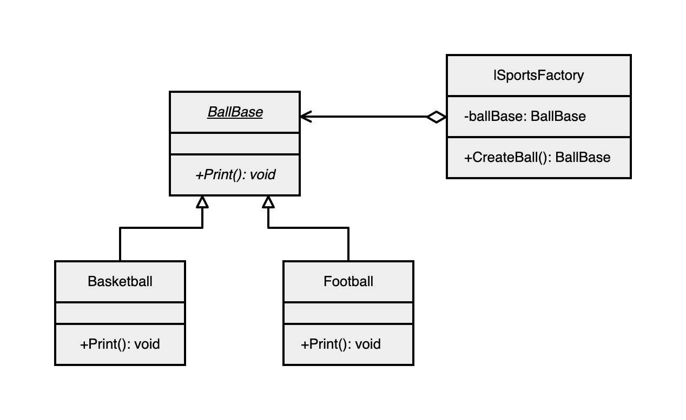

# 工厂模式 - - 简单工厂

### 基本思想

+ 简单工厂就是一个生产对象的类，它的主要作用是创建具体的产品类实例

### UML关系图
 

### 实现
+ 创建一个基类类，目的是利用多态的特性
    + 这里是个球类
```csharp
abstract class BallBase {
    public abstract void Print ();
}
```

+ 创建具体的类，用于被生产
```csharp
class Basketball : BallBase {
    public override void Print () {
        System.Console.WriteLine ("造好一个篮球");
    }
}

class Football : BallBase {
    public override void Print () {
        System.Console.WriteLine ("造好一个足球");
    }
}
```

+ 创建工厂
```csharp
class SportsFactory {
	//声明基类对象，用于多态
    private BallBase ballBase = null;

    //生产对象
    public BallBase CreateBall (string str) {
        switch (str) {
            case "篮球":
                ballBase = new Basketball ();//多态
                break;
            case "足球":
                ballBase = new Football ();
                break;
        }
        return ballBase;
    }
}
```
+ 通过工厂类达到解耦合关系
------

+ main 测试
```csharp
static void Main () {
	//创建工厂实例
	SportsFactory sportsFactory = new SportsFactory ();

	BallBase b1 = sportsFactory.CreateBall ("篮球");
	BallBase b2 = sportsFactory.CreateBall ("足球");

	b1.Print ();
	b2.Print ();
}
```
### 优缺点
+ 优点
    + 降低了客户与产品之间的耦合度 - - 需要什么告诉工厂，由工厂来生产
    + 实现了代码的复用
+ 缺点
    + 一定程度上违背了开闭原则
    + 在新增产品时需要修改简单工厂类 - - 也就是上面的`case`逻辑
