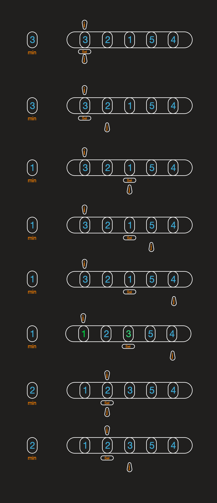

# 选择排序

> 把第一位 i 指向的数默认为最小数 min  

> j 向后依次索引  

> 如果找到比min还小的数  

> 把这个数赋给 min （min保存当前循环最小值）  

> 这个数下标赋给 sel （sel作为下标选择指向这个最小数）  

> 直到j找完这列  

> 把 i 指向的数和 sel选中的数交换  

> i 向前一位  

> 重复以上步骤直到 i 等于最后一个数
 
 
 
 ## 代码实现c++
 ```c++
 void Selection(int* arr，int len){
    int min, sel, temp;
    for (int i = 0; i < len; ++i) {
        min = arr[i];
        sel = i;
        temp = 0;
        for (int j = i + 1; j < len; ++j) {
            if (arr[j] < min){
                min = arr[j];
                sel = j;
            }
        }
        if (i != sel){
            temp = arr[i];
            arr[i] = arr[sel];
            arr[sel] = temp;
        }
    }
}
 ```

