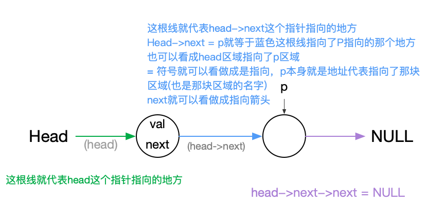
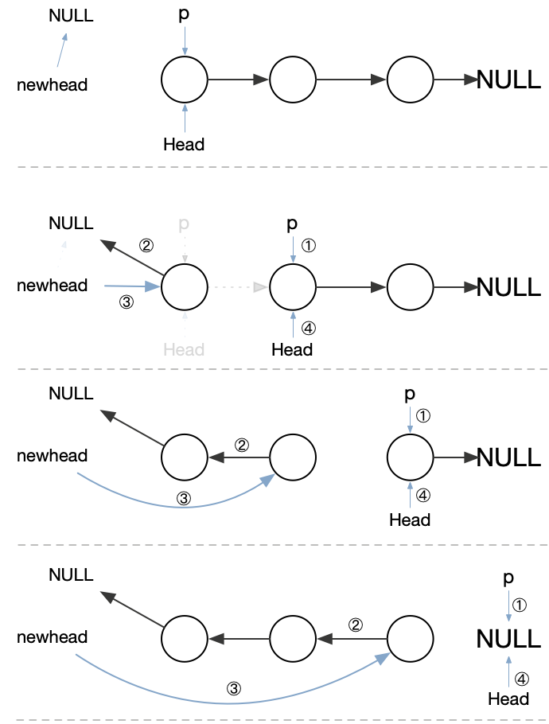

### 链表
--------
### 关于节点的判断
+ `p`其实就是一个存地址的 只要存有东西就大于0 所以就是true
```c++
node* p = nullptr;

if(p) cout << "p不为空" << endl;
else cout << "p为空" << endl;
```
+ 循环也一样 只有等`p == nullptr` 的时候p的值就是0 是false就跳出循环
```c++
ListNode* p;
int i = 0;
while (p) {
    if (i++ > 3){
        cout << "一直不为空就死循环" << endl;
        break;
    }
}
```

### 常用技巧片段
取size
```c++
int len;
for (ListNode* head = root; head; head = head->next) ++len;
```

取前几位
```c++
ListNode* CalculateCount(ListNode* l){
    if (!l) return 0;
    int c = 0;
    ListNode* p = l;
    while (p && ++c < 2) {
        c += p->val;
        p = p->next;
    }
    cout<<c;
    return p;
}
```
**递归翻转**

res一直递归下去 直到走到最后一个节点 不满足if条件 return head也就是把最后一个节点返回出来 给到了newlist 同时head出栈 返回到上一层 然后继续进行res后面的操作 改箭头指向
```c++
ListNode* res(ListNode* head){
    if (!head || !head->next) return head;
    ListNode* newlist =  res(head->next);
    head->next->next = head;
    head->next = nullptr;
    return newlist;
}
```

**单链表节点之间对调** 

head 本身就是第一个节点 `head->next` 就是下一个要指向的地方改next也就是改指向`head->next->next`同理，改的就是第二个节点指向的地方

```c++
head->next->next = head;
head->next = nullptr;
```

理解head和head->next 
 

**双指针翻转** 

```c++
ListNode* res(ListNode* head){
    if (!head || !head->next) return head;
    ListNode* newhead = nullptr;
    ListNode* p = head;
    while (p) {
        p = head->next;//①
        head->next = newhead;//②
        newhead = head;//③
        head = p;//④
    }
    return newhead;
}
```
 

**三指针翻转** 
```c++
ListNode* ReverseList(ListNode *head){
    if (head == nullptr || head->next == nullptr){
      return head;
    }else{
        
        ListNode *p1 = head;
        ListNode *p2 = p1->next;
        ListNode *p3 = p2->next;//p3为了记录p2后的节点是否为空
        
        while (p2) {
            p3 = p2->next;
            p2->next = p1;
            p1 = p2;
            p2 = p3;
        }

        head->next = nullptr;//头指向那个区域的next指针置空 因为变成最后一块了
        head = p1;//跑到前头起带头作用
        return head;
    }
}
```

链表前进一位
`l1 = l1 ? l1->next : nulltpr;`

两个链表相加
`int sum = (l1 ? l1->val : 0) + (l2 ? l2->val : 0);`
