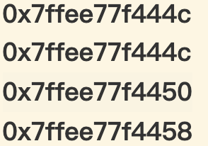
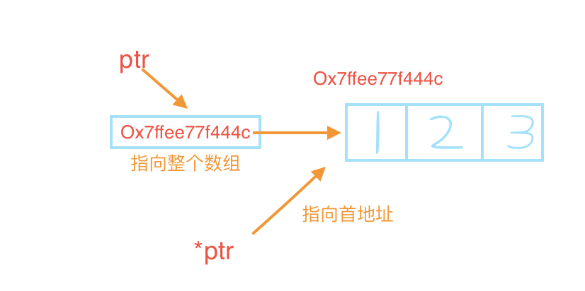

# 数组
>两大特性
>>1.不准拷贝数组  
>>2.使用数组时(通常)会将转化其指针
## 数组和指针的关系

+ 对数组取地址，arr和&arr返回结果看似一样,其实不然
```c++
int arr[] = {1, 2, 3};
cout << arr << endl;
cout << &arr << endl;
cout << arr + 1 << endl;
cout << &arr + 1 << endl;
```
 
--------

+ 数组名 **直接** 赋值，返回的是数组 **第一个** 元素的地址
    > `int* ptr_1 = arr;` 
    
    > `arr` 返回数组首地址

+ 数组名 **取地址** 赋值，返回的是 **整个** 数组的首地址

    >`int (*ptr_2)[3] = &arr;` 
    
    > `&arr` 返回整个数组 （相当于把数组打了个包，这个包的地址存在ptr_2）


+ 对数组名取地址返回的是指向数组的指针
```c++
int (*ptr)[3] = &arr;   // 用数组指针接收
cout << ptr << endl;    // ptr现在指向一个空间大小为3的数组
cout << ptr + 1 << endl;// ptr地址实际会加12，ptr代表指向整个数组
                        // (整个数组大小为3) x (int占4字节) x 1 = 12
cout << *ptr <<endl;    // ptr现在代表数组首地址
cout << *ptr + 1 <<endl;// ptr地址会加4
                        // (int占4字节) x 1 = 4
cout << **ptr << endl;  // 第一次解代表指向一条数组，第二次解代表这条数组的第一个元素
```


+ 数组名赋值 等于 赋值数组首地址

    `int* ptr2 = arr;` 等价 `int* ptr2 = &arr[0];` 

+ `arr[1]` 等价 `*(arr + 1)` 前者是内置语法不是重载 

## 区分指针数组和数组指针
+ 指针数组 - - 存 **指针** 的数组 （是个数组！）
    > `int* ptr[4];` ptr是数组，4个空间，存类型为int的指针
    
    > `int m_a = 10;` 
    
    > `ptr[0] = &a;` 数组第一个元素存 a的地址
    
    > `*ptr[0]` ptr[0]现在代表a的地址，解引用后就是实际存储a的值- - 10
    
+ 数组指针 - - 存 **数组** 的指针 （是个指针！）
    > `int (*ptr)[4];` ptr是指针，指向大小为4的数组，数组类型为int
    
    > `int arr[4]{1,2,3,4};` 
    
    > `ptr = &arr;` ptr指向整个数组，如上图
    
    > `*ptr` 指向数组第一个地址，如上图- -等价`ptr[0]`
    
    > `*(*ptr)` 解引用第一个地址，现在代表数组第一个空间，可以进行赋值操作- -等价`*ptr[0]`
    
    > `*(*ptr + 1)` 解引用第二个地址，现在代表数组第二个空间- -等价`*ptr[1]`


