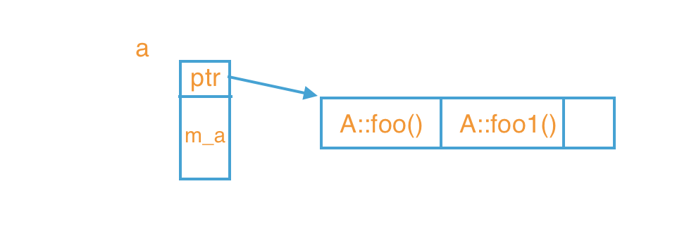
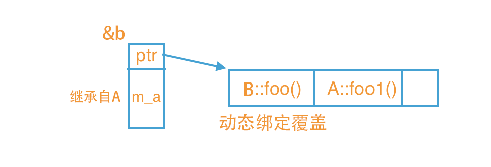

# 多态

## 虚函数表（vtable）

+ 当成员函数被声明为虚函数时，在当前类的对象里，会在对象头部生成一个指针指向一张表，这张表就是来维护基类和派生类的调用和覆盖问题

```c++
class A {
protected:
    int m_a;
public:
    virtual void foo (){
        cout << "A::foo()" << endl;
    }
    virtual void foo1 (){
        cout << "A::foo1()" << endl;
    }
};

void main () {
    A a;// 内存布局如下
    cout << sizeof(a);  //16字节 -- m_a本来占4字节，但有虚函数，
                        //所以编译器隐式地添加了一个指向虚表的指针（64位机占8字节），
                        //又字节对齐，所以16字节
}
```
 
> ⭐️有vritual才有ptr，ptr作为指针变量和普通成员变量m_a无区别，子类继承后都会 **独立** 存在于子类
```c++
class B : public A {
public:
    void foo (){
        cout << "B::foo()" << endl;
    }
};
//main
B b;// 内存布局如下
```
 
> ⭐️图1图2的ptr，名字一样但地址不一样，所以指向的虚表也不一样  
所以每个对象都有自己的虚表 -- 前提 父类 有虚函数
```c++
//main
A* ptr_a = new B();
ptr_a->foo();   // B::foo --去虚表找
ptr_a->foo1();  // A::foo1 --同上
```

## 静态绑定和动态绑定

+ 概念

    > 静态类型：对象在声明时采用的类型，在编译期既已确定

    > 动态类型：通常是指一个指针或引用目前所指对象的类型，是在运行期决定的

    > 静态绑定：绑定的是静态类型，所对应的函数或属性依赖于对象的静态类型，发生在编译期

    > 动态绑定：绑定的是动态类型，所对应的函数或属性依赖于对象的动态类型，发生在运行期


+ 非虚函数一般都是静态绑定，而虚函数都是动态绑定

```c++
class A {
public:
    /*virtual*/ void func(){ cout << "A::func()\n"; }
};

class B : public A {
public:
    void func(){ cout << "B::func()\n"; }
};

class C : public A {
public:
    void func(){ cout << "C::func()\n"; }
};

void main () {
    C* ptr_c = new C(); //ptr_c 的静态类型是它声明的类型C*，动态类型也是C*；
    B* ptr_b = new B(); //ptr_b 的静态类型和动态类型都是B*；
    A* ptr_a = ptr_c;   //ptr_a 的静态类型是它声明的类型A*，动态类型是ptr_a所指向的对象ptr_c的类型C*；
    ptr_a = ptr_b;      //ptr_a 的动态类型可以更改，现在它的动态类型是B*，但其静态类型仍是声明时候的A*；
    C *ptr_null = NULL; //ptr_null 的静态类型是它声明的类型C*,没有动态类型，因为它指向了NULL；

}
```
```c++
//main
    ptr_a->func();      //A::func() ptr_a的静态类型永远都是A*。动态类型则要看绑定的方式，此时func是一个no-virtual,所以选择静态绑定，也就是选静态类型A*，所以肯定调用A::func()
    ptr_c->func();      //C::func() ptr_c的动、静态类型都是C*，因此调用C::func()；
    ptr_null->func();   //C::func() 空指针也可以调用函数，因为这在编译期就确定了
```
注释C类里的func语句后
```c++
    ptr_a->func();      //同上
    ptr_c->func();      //ptr_c里没有func函数了，因此只有去父类找
    ptr_null->func();   //同上
```
注释A类的virtual后
```c++
    ptr_a->func();      //B::func() 因为有了virtual虚函数特性，现在是动态绑定，也就是选动态类型，此时ptr_a的动态类型指向B*，因此先在B中查找，找到后直接调用；
    ptr_c->func();      //C::func() ptr_c的动、静态类型都是C*，所有先在C中查找；
    ptr_null->func();   //空指针异常，因为是func是virtual函数，因此对func的调用只能等到运行期才能确定，然后才发现ptr_null是空指针；
```
+ 动、静态绑定总结

	+ 如果基类A中的func不是virtual函数，那么不论ptr_a、ptr_b、ptr_c指向哪个子类对象，对func的调用都是在定义ptr_a、ptr_b、pre_c时的静态类型决定，早已在编译期确定了。
    
    + 同样的空指针也能够直接调用no-virtual函数而不报错（这也说明一定要做空指针检查），因此静态绑定不能实现多态
    
    + 如果func是虚函数，那所有的调用都要等到运行时根据其指向对象的类型才能确定，比起静态绑定自然是要有性能损失的，但是却能实现多态特性

	+ 所以大白话就是想用多态:
		+ 有继承关系

		+ 父类左 **=** 子类右 或 形参是基类（只能子对象给父对象赋值
）
		+ 父类对象必须是**指针** 、**引用**

		+ 被调函数必须是虚函数（才能满足动态绑定）

+ 动、静态绑定区别

	+ 静态绑定发生在编译期，动态绑定发生在运行期

	+ 对象的动态类型可以更改，但是静态类型无法更改

	+ 要想实现动态，必须使用**动态绑定**(指针或引用）

	+ 在继承体系中只有虚函数使用的是动态绑定，其他的全部是静态绑定
	


